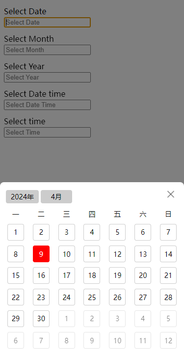
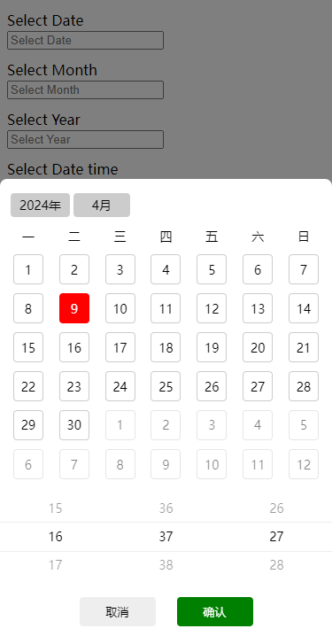
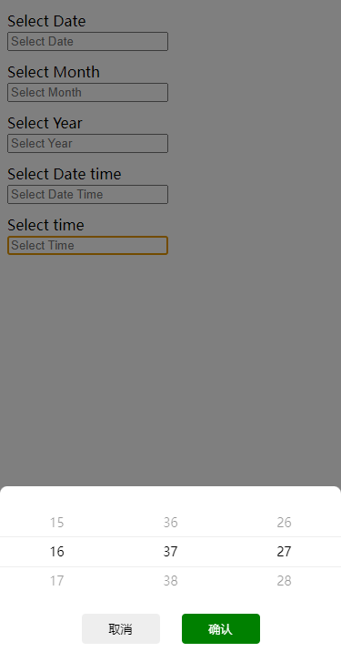

# d-calendar

#### 介绍
h5时间/日期/月份/年份选择，文件小，无依赖包；样式简陋，可自行修改覆盖

#### 例子
```html
<link rel="stylesheet" href="../dist/calendar.css">

<input id="date" type="text" placeholder="Select Date">

<script src="../dist/calendar.js"></script>
<script>
  window.calendarInit({
    target: '#date',
    type: 'date', // month | year | date-time | time
    minYear: 2000,
    maxYear: 2024,
    maskClosable: true, // 是否点击遮罩层关闭
    dayChange: function (value) {
      console.log('date: ' + value)
    },
    monthChange: function (value) {
      console.log('month: ' + value)
    },
    yearChange: function (value) {
      console.log('year: ' + value)
    },
    timeChange: function (value) {
      console.log('time: ' + value)
    },
    dateTimeChange: function (value) {
      console.log('date-time: ' + value)
    }
  })
</script>
```



