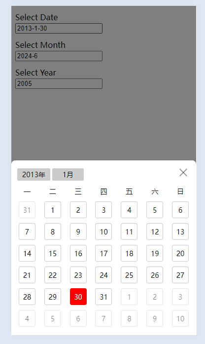

# d-calendar

#### 介绍
h5日期/月份/年份选择，文件小，无依赖包；样式简陋，可自行修改覆盖

#### 例子
```html
<link rel="stylesheet" href="../dist/calendar.css">

<input id="date" type="text" placeholder="Select Date">

<script src="../dist/calendar.js"></script>
<script>
  window.calendarInit({
    target: '#date',
    dayChange: function (value) {
      console.log('date: ' + value)
    }
  })
</script>
```

